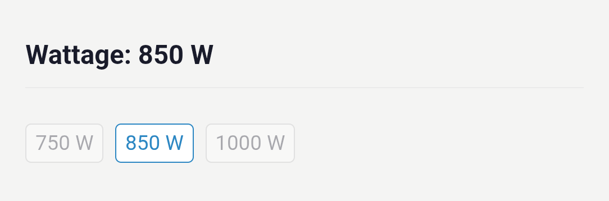

# US

*Last updated on 25/06/02*

**Prices WILL change over time, so check pricing on all of the units before purchasing!**

**Please read the main page first before using these recommendations.**

**IMPORTANT: PSU wattage variants will not be listed as individual links. Please use the PCPP selection filters/search (models that do not have the selection filter e.g. Vetroo GV) to get the wattage you want.**

**Baller:**

Corsair AX1600i - [Link](https://pcpartpicker.com/product/cJbwrH/corsair-ax1600i-1600-w-80-titanium-certified-fully-modular-atx-power-supply-cp-9020087-na)

NZXT C1500 - [Link](https://pcpartpicker.com/product/RLZXsY/nzxt-c1500-1500-w-80-platinum-certified-fully-modular-atx-power-supply-pa-5p1bb-us)

Corsair HXi (2023) - [Link](https://pcpartpicker.com/product/fFbRsY/corsair-hx1500i-2023-1500-w-80-platinum-certified-fully-modular-atx-power-supply-cp-9020261-na)

Adata XPG Cybercore II - [Link](https://pcpartpicker.com/product/FChv6h/adata-xpg-cybercore-ii-1300-w-80-platinum-certified-fully-modular-atx-power-supply-cybercoreii1300p-bkcus)

**Mainstream:**

Corsair RMx (2024) - [Link](https://pcpartpicker.com/product/vY4Zxr/corsair-rm850x-2024-850-w-fully-modular-atx-power-supply-cp-9020270-na)

Corsair RMx Shift* - [Link](https://pcpartpicker.com/product/bGJp99/corsair-rm750x-shift-750-w-80-gold-certified-fully-modular-side-interface-atx-power-supply-cp-9020251-na)

* = Case Compatibility needs to be checked due to the location of the cable connectors.

NZXT C Gold (2024/3.1) - [link](https://pcpartpicker.com/product/qDLdnQ/nzxt-c850-2024-850-w-80-gold-certified-fully-modular-atx-power-supply-pa-8g2bb-us)

Adata XPG Core Reactor II - [link](https://pcpartpicker.com/product/zfGhP6/adata-xpg-core-reactor-ii-750-w-80-gold-certified-fully-modular-atx-power-supply-corereactorii750g-bkcus)

Adata XPG Core Reactor II VE - [Link](https://pcpartpicker.com/product/dLTZxr/adata-xpg-core-reactor-ii-ve-750-w-80-gold-certified-fully-modular-atx-power-supply-corereactoriive750g-bkcus)

Montech Century II - [Link](https://pcpartpicker.com/product/yJkqqs/montech-century-ii-1050-w-80-gold-certified-fully-modular-atx-power-supply-century-ii-1050w)

**Budget:**

Montech APX - [Link](https://pcpartpicker.com/product/hcbypg/montech-apx-650-w-80-certified-atx-power-supply-apx-650w)

