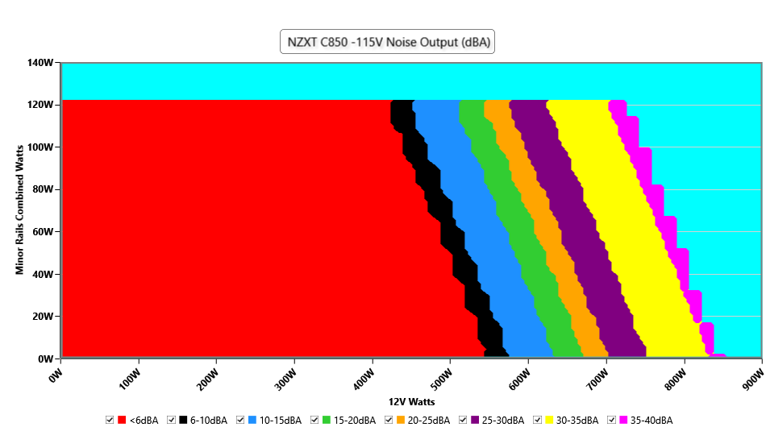

# Noise

## What does Noise even mean?

Noise determines how quiet or how loud your PSU is. It may or may not be important to you depending on your preferences and the location of the PC.

# Noise Graphs

**NOTE: The term "Color Charts" is NOT an official term and is just used here to provide a easier explanation and to reduce confusion.**

There are two main types of graphs: **Average Noise charts** and **Color charts**. Average noise is the average noise figures of the PSU, while Color charts give you an accurate representation of the noise figures at X wattage on the Major and Minor rails. Because of this, I reccomend using color charts as they are more accurate and are easy to read.

Good sources for Color charts include:

[Hardware Busters](https://hwbusters.com/)

[Cybenetics](https://www.cybenetics.com/)

and more.

**IMPORTANT: Cybenetics LAMDBA ratings are SEPARATE from color charts!**

# How to read Color Charts

**IMPORTANT: Cybenetics always keeps the fan on, so on units with Zero RPM Mode, please be aware!**

The colors represent a certain level of noise, measured in DBa. The load gets higher as you go from left to right, so the end of the graph is full load and the start of it is idle.

The bottom line of numbers represent the Major rails, and the line of numbers on the Side represent the Minor rails.
